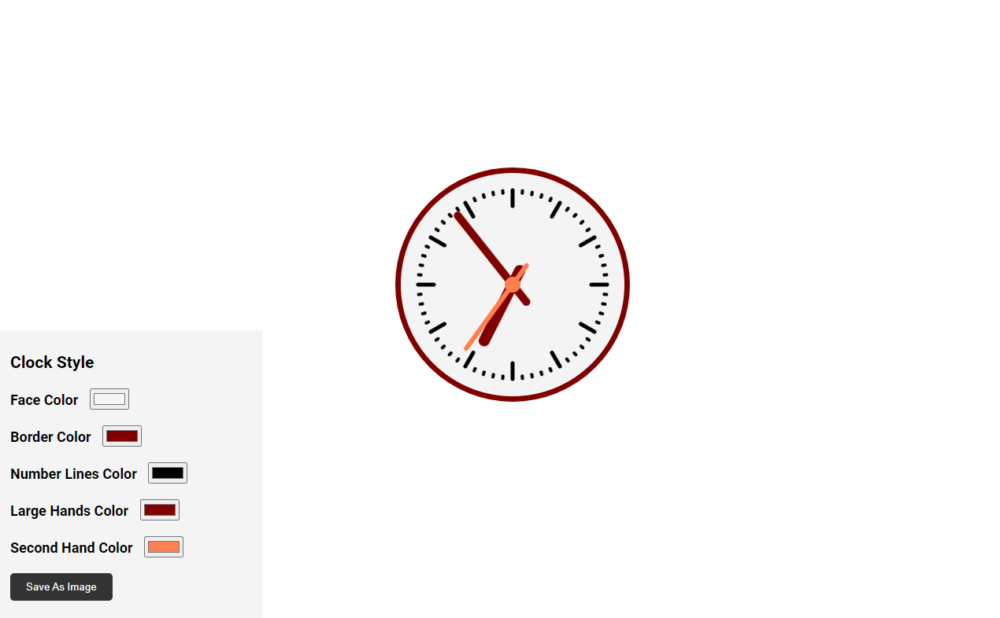

# API - Modern JavaScript from the Beginning - Second Edition - O'Reilly

This repository contains projects from Brad Traversy's course "Modern JavaScript from the Beginning - Second Edition".

These projects are focused on Web Browser APIs.

# Project 01: Animated Clock

Clock in action: https://youtu.be/AkSkDdQupkQ
